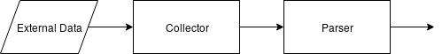

# Collectors

Collectors are *n6*'s entry points for any external data to flow in.
Data harvested with the collector is then sent to its corresponding parser.
So the pipeline at this stage looks like this:

Parser will translate the data to the *n6*-understandable normalized format.
The role of the collector is to acquire the data and send it
further down the pipeline so that other components do not have to
concern themselves with external connections.

## Using a collector

As of the time this documentation is being created collectors are
used each as its own process, possibly being started from `cron` using
the generated collectors' commands. 

### Persistent state

What is more, some collectors need to maintain a state (for example, the *id* of the
last downloaded record so that on next collector runs we will download only new records),
stored between consecutive runs.

Each class of such a stateful collector need to refer to its own state that
will not be shared with other classes.
*n6*'s helper class `CollectorStateMixIn` takes care of that.

## Collector implementation

All collectors interact with their respective task queue to send the
collected data to the parser. To deal with messaging queues *n6* uses
[`RabbitMQ`](https://www.rabbitmq.com/) which uses the AMQP protocol.

However if you implement collector you should not interact with
the queue by yourself. There are many base classes
for your collector implementation to derive from that take
care of most of the communication, initialization and shutting down
functionality so that you can focus solely on the collectors' logic.
All of those classes can be found in `N6Core` in the module
`n6.collectors.generic`. (The path of the module file in the *n6*
source code repository is: `N6Core/n6/collectors/generic.py`.)

Contents
--------

* [Console command](command.md)
* [Base classes](classes.md)
* [State](state.md)
* [Hi-Freq data sources](hifreq.md)
* [Testing](testing.md)

