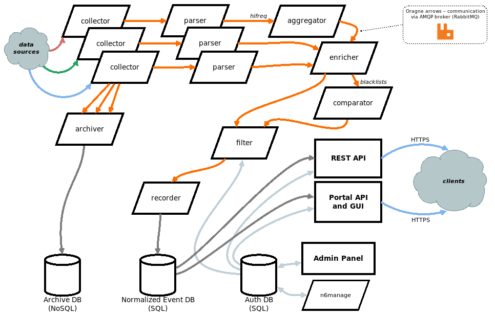

# Working with the *n6* pipeline



* Run some collector to check data flow.

```bash
(env)$ n6collector_spam404
```

> Note: firstly you may want to temporarily terminate the corresponding
parser to see incoming messages on its queue if it is being run by the *Supervisor* (command
`stop <process>`).

* Log into the RabbitMQ web management panel to check message queues.
* Log into the *n6* Portal and query the *n6* API through the search form.
* Query the *n6* REST API (you can use *CURL*, web browser, etc.).
