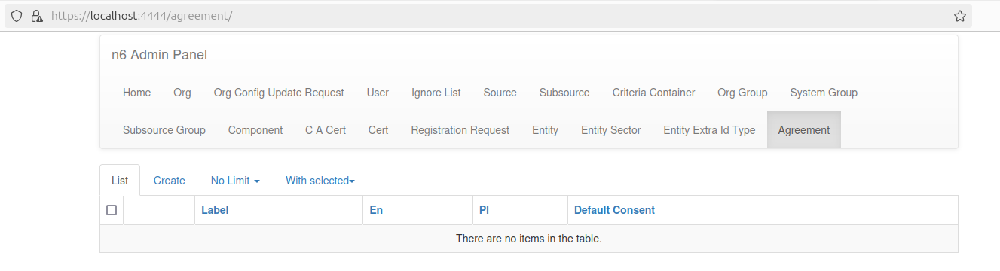
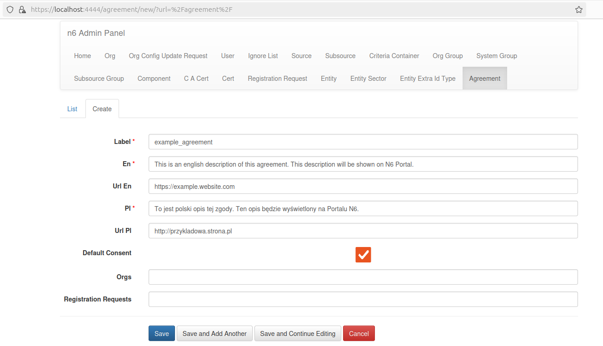
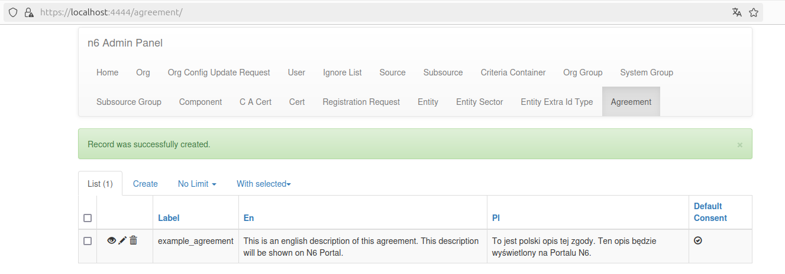
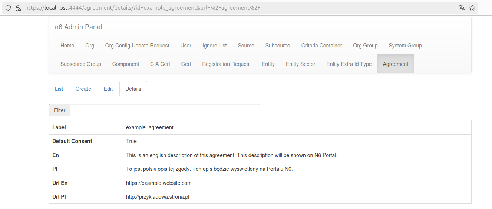

# Management in _n6 Admin Panel_

## Overview

Managing Organization _Agreements_ does not differ from managing other models in _n6 Admin Panel_. This documentation provides visual guidance and information on managing _Agreements_ and their relations.

## Adding _Agreements_

As mentioned in the introduction, by default _n6_ does not provide any optional agreements by itself. They can be added using the Admin Panel, under the _Agreement_ tab.

_Empty Agreement tab in List view._

In the _Create_ view there is a simple form to be filled in. Saving it will automatically create a new _Agreement_, immediately available to your users. Note that it is also possible to immediately bind _Organizations_ and _Registration Requests_ to this agreement. If any field is filled incorrectly (e.g., invalid link...), an appropriate error is thrown (signalized by displaying an appropriate message), preventing the creation of an invalid _Agreement_.

_Create / Edit Agreement form view._

## Viewing _Agreements_

After creating some _Agreement_ instances, they can be seen in the _List_ view. There are a few action buttons on the left to each record that allow you to (accordingly) view in _Detail_, _Edit_ or _Delete_ the _Agreement_.

_Agreement tab with a single record in List view._

After clicking on the eye icon, the _Detail_ view is shown, displaying all [schema](model.md/#agreement-schema) fields with their current values.

_Detail view_

## Editing _Agreements_

Editing agreements is available by clicking the pen icon. A similar form to the _Create_ view's one is used to edit entries.

## Deleting _Agreements_

Deleting agreements is available by clicking the trash icon. Deleting an _Agreement_ removes it from checked agreements in every related _Registration Request_ and _Org_.
