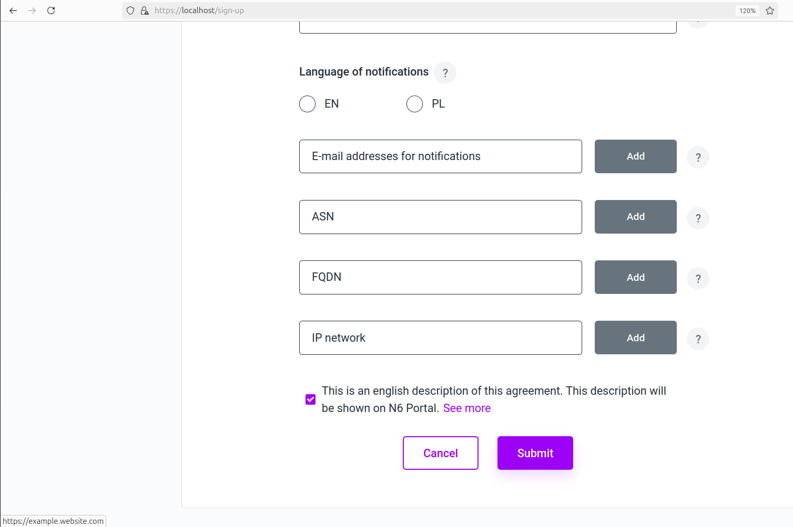
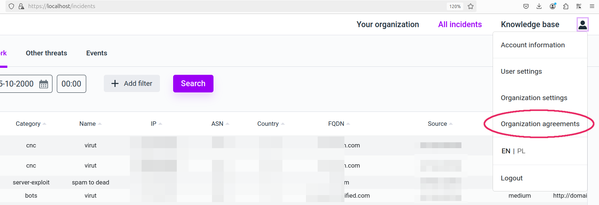
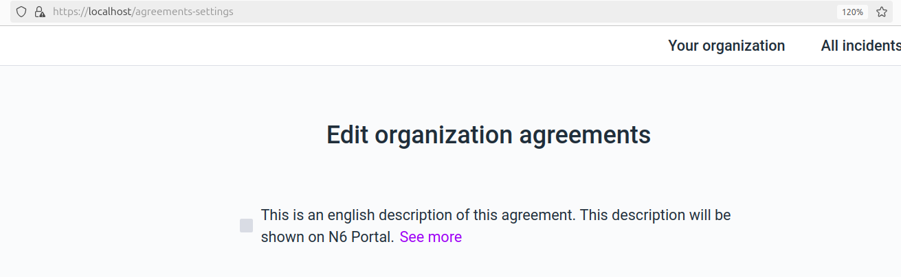
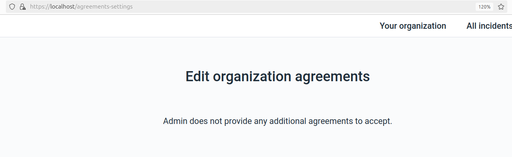

# Appearance in _n6 Portal_

## Overview

Introducing any _Agreements_ within an _n6_ instance causes minor changes to the _n6 Portal_'s appearance, allowing users to interact with the agreements, i.e., to agree or disagree (in the name of the user's organization) to the agreements' terms.

## Registration form

If any agreements exist, they are shown at the bottom of the second page of the _registration form_. Whether they are checked by default or not is determined by the `default_consent` flag (as per [schema](model.md/#agreement-schema)).

_Registration form. Notice the **See more** hyperlink which takes the user to `url_en`, in this case `https://example.website.com`. This hyperlink is to be rendered only if the URL for the current language is defined._

## Navigation bar (menu)

When at least one agreement is provided, a new menu item becomes available to users: _Organization agreements_.

_Navigation bar with additional **Organization agreements** item. This item would not be there if no agreements have been created._

## _Organization agreements_ page

On the **Organization agreements** page, all agreements are visible, and users are able to manage their _Org_'s agreements by clicking the checkboxes.

_Organization agreements page. Here: with a single agreement item. Note that the item is not checked as accepted even though the agreement's flag `default_consent` is set (that flag refers only to the registration form)._

If there are no agreements, a short message is presented, informing that no agreements are available.

_Organization agreements page with no agreements._
